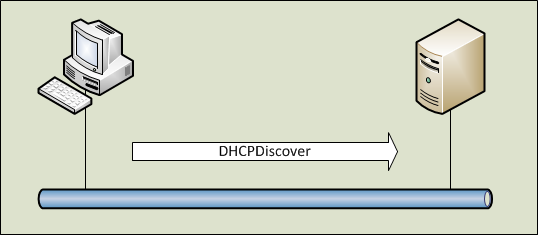
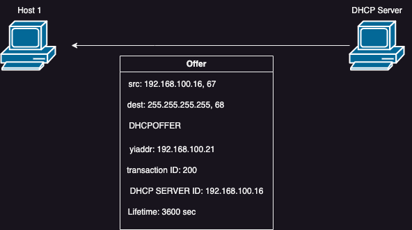
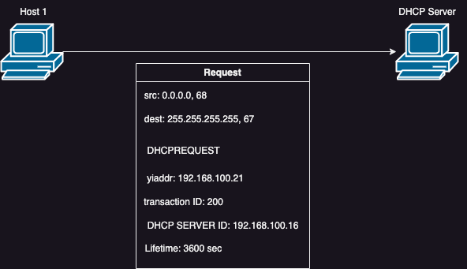
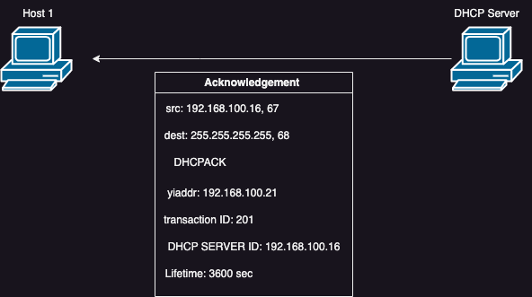
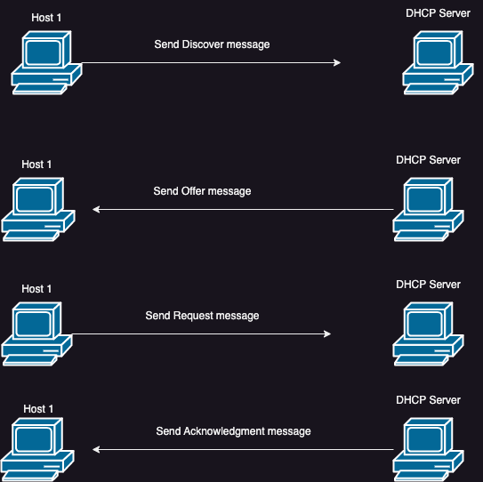

# DHCP Server — Concepts & Ubuntu Installation Guide

A concise, illustrated guide to **DHCP (Dynamic Host Configuration Protocol)** — how it works, and a hands-on walkthrough for installing and configuring `isc-dhcp-server` on Ubuntu Server, including IP reservation for a client by MAC address.

> Slide decks are written in [Marp](https://marp.app/) markdown, so they also render cleanly as plain documents right here on GitHub.

## Contents

| File | Description |
|---|---|
| [`DHCPIntroduction.md`](DHCPIntroduction.md) · [PDF](DHCPIntroduction.pdf) | What DHCP is, the DORA process, and the three types of address allocation |
| [`DHCPInstallation.md`](DHCPInstallation.md) · [PDF](DHCPInstallation.pdf) | Step-by-step lab: creating VMs, installing `isc-dhcp-server`, configuring the scope, firewall, and reserving an IP by MAC address |

## How DHCP Works: The DORA Process

A DHCP client obtains an IP address from the server in four steps, known as **DORA**:

1. **Discover** — the client broadcasts a request for an IP address.
2. **Offer** — the server responds with an available IP address.
3. **Request** — the client requests the offered address.
4. **Acknowledge** — the server confirms the lease.

<table>
<tr>
<td align="center"><br><sub>1. Discover</sub></td>
<td align="center"><br><sub>2. Offer</sub></td>
</tr>
<tr>
<td align="center"><br><sub>3. Request</sub></td>
<td align="center"><br><sub>4. Acknowledge</sub></td>
</tr>
</table>

<p align="center">
  
</p>

## Lab Setup

The installation guide walks through a lab built with VMware Workstation running one DHCP server and two client hosts, all on Ubuntu Server 22.04.

<p align="center">
  
</p>

Topics covered in [`DHCPInstallation.md`](DHCPInstallation.md):

- Installing `isc-dhcp-server` via `apt`
- Backing up and editing `/etc/dhcp/dhcpd.conf`
- Setting the listening interface in `/etc/default/isc-dhcp-server`
- Opening the DHCP port through `ufw`
- Restarting and checking service status
- Viewing active leases with `dhcp-lease-list`
- Reserving a static IP for a client by MAC address
- Troubleshooting via `/var/log/syslog`

## Viewing the Slide Decks

The `.md` files double as Marp presentations. To view them as slides:

```bash
npx @marp-team/marp-cli DHCPIntroduction.md -o DHCPIntroduction.html
```

Or install the [Marp for VS Code](https://marketplace.visualstudio.com/items?itemName=marp-team.marp-vscode) extension for live preview.

## Author

**Omer**

## License

This project is licensed under the [MIT License](LICENSE).
